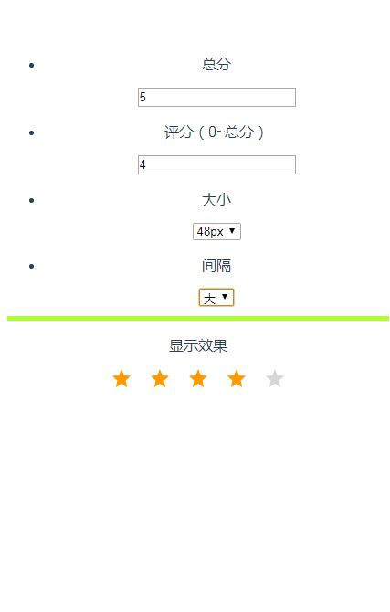

# vue-score-to-star
a vue component，represent a score with some stars , visually

## 预览


## 使用
``` bash
	<star
      :total="5"
      :score="2.6"
      :size="36"
      :space="'middle'"
    ></star>
	...
	import star from 'vue-score-to-star'
	...
	components: {star}
```
## 配置
``` bash
	total: 一个正数，表示星的总个数 
	score: 一个正数，表示亮星的个数，小数部分超过0.5是半星
	size: 一个数字，限定取值24/36/48，代表大小24px/36px/48px
	space: 一个字符串，限定large/middle/small，代表间距大/中/小
```

## Build Setup   这是vue-cli的脚本命令

``` bash
# install dependencies
npm install

# serve with hot reload at localhost:8080
npm run dev

# build for production with minification
npm run build

# build for production and view the bundle analyzer report
npm run build --report
```
